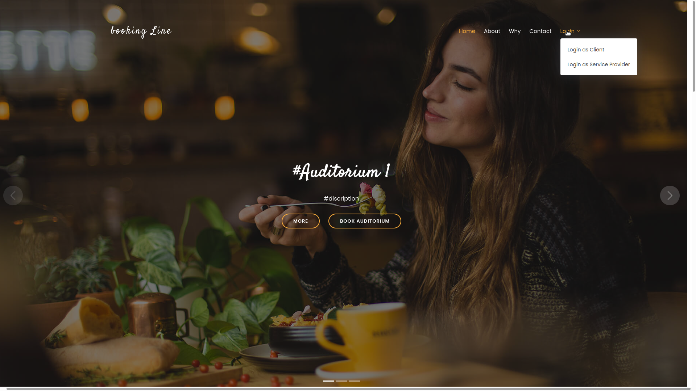
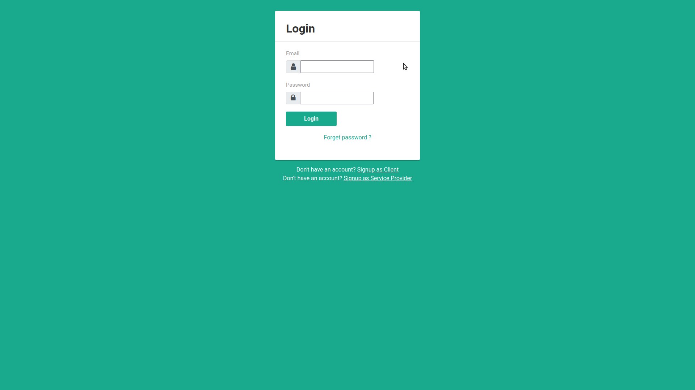
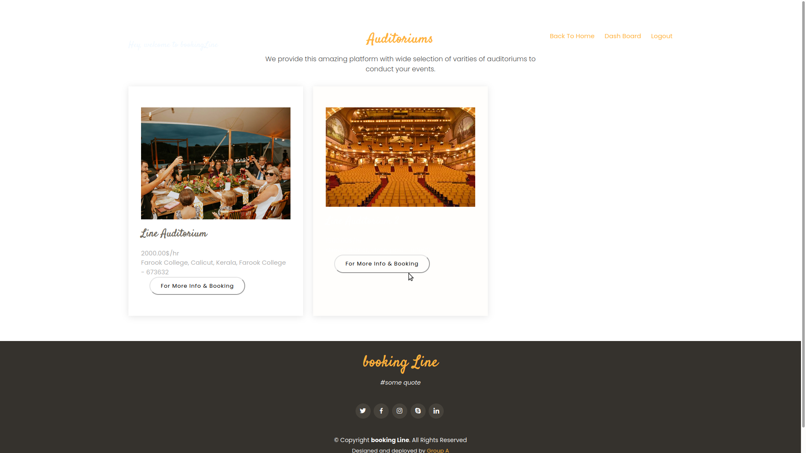
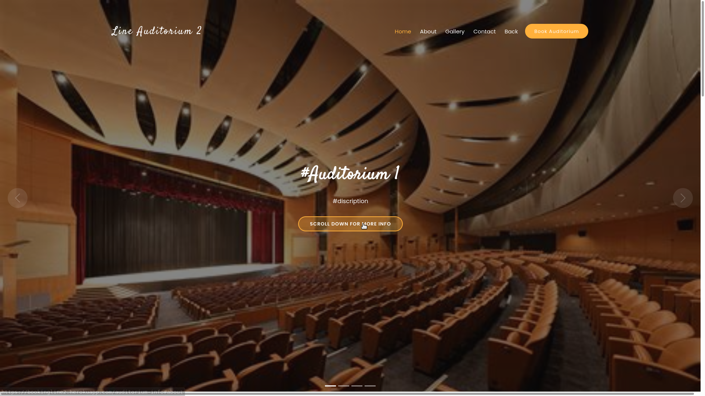
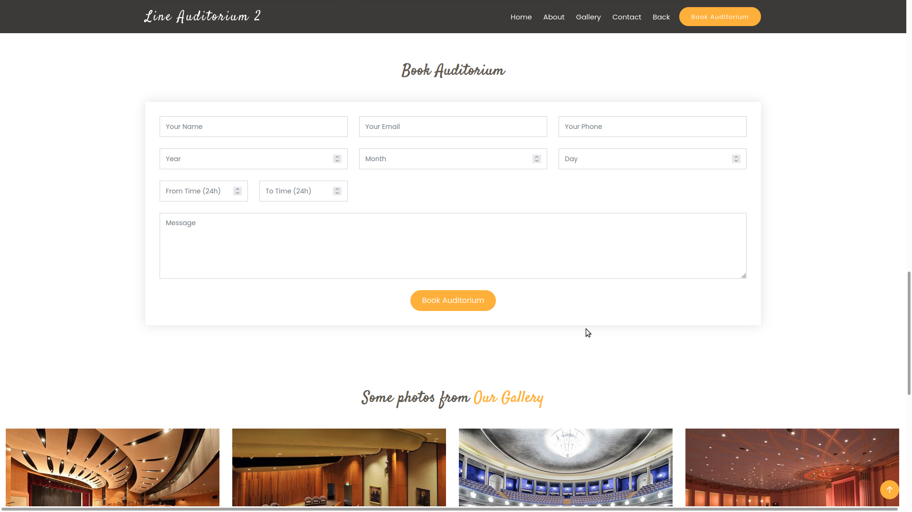
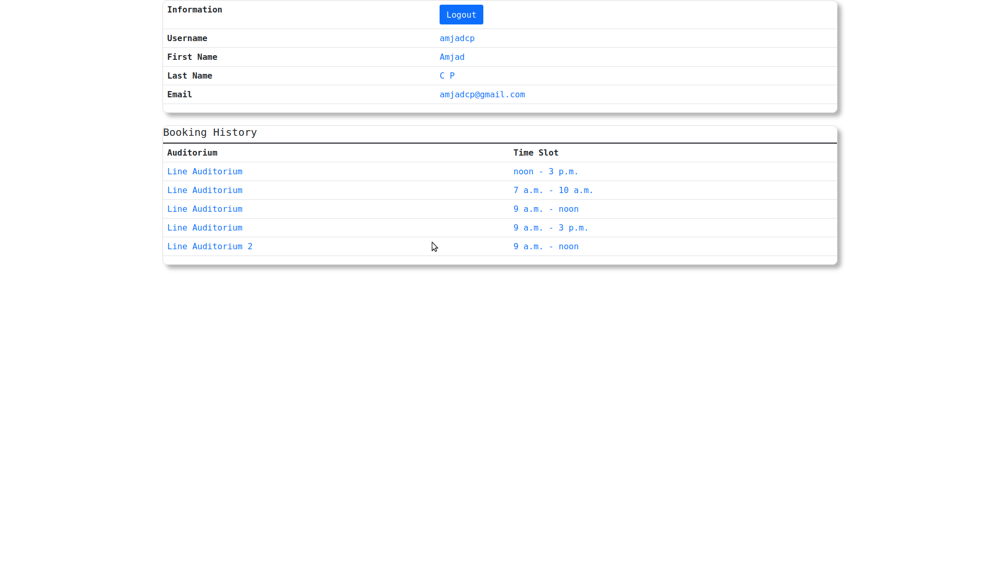
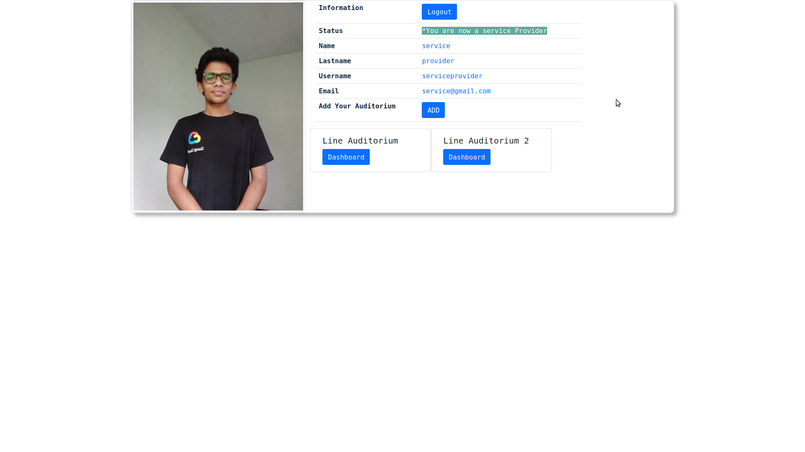
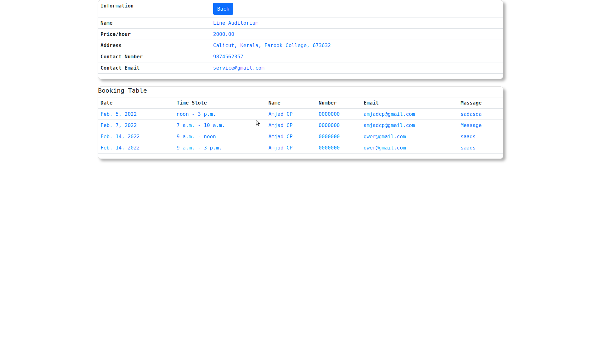

<!-- PROJECT HEAD -->
<br />

  <h1 align="center">booking Line</h1>

  <p align="center">
'booking Line' is the booking platform to book auditoriums in your city and also auditoriums can list here as 'service providers' 
    <br />
    <a href="https://bookingline2.herokuapp.com/"><strong>Explore the site »</strong></a>
    <br />
    <br />
    <a href="https://github.com/amjadcp/bookingLine-grpA-miniProject/issues">Report Bug</a>
    ·
    <a href="https://github.com/amjadcp/bookingLine-grpA-miniProject/issues">Request Feature</a>
  </p>
</p>

 <br>
 <br>
 <br>
 <br>
 <br>
 <br>
 <br>
 <br>


<!-- TABLE OF CONTENTS -->
<details open="open">
  <summary>Table of Contents</summary>
  <ol>
    <li>
      <a href="#about-the-project">About The Project</a>
      <ul>
        <li><a href="#built-with">Built With</a></li>
      </ul>
    </li>
    <li>
      <a href="#getting-started">Getting Started</a>
      <ul>
        <li><a href="#prerequisites">Prerequisites</a></li>
        <li><a href="#installation">To use</a></li>
      </ul>
    </li>
    <li><a href="#roadmap">Roadmap</a></li>
    <li><a href="#contributing">Contributing</a></li>
    <li><a href="#license">License</a></li>
    <li><a href="#project-link">Project Link</a></li>
    <li><a href="#module-of-project">Module of Project</a></li>
    <li><a href="#status-of-project">Status of Project</a></li>
    <li><a href="#to-do-list">To-Do List</a></li>
    <li><a href="#contributers">Contributers</a></li>
  </ol>
</details>


<!-- ABOUT THE PROJECT -->
## About The Project

'booking Line' is the booking platform to book auditoriums in your city and also auditoriums can list here as 'service providers' 

Here's why:
* It keeps all auditoriums in your city in one place
* You can select auditorium with your budget range
* You join as a service providers
 

A list of commonly used resources that I find helpful are listed in the acknowledgements.

### Built With

* [HTML](https://html.spec.whatwg.org/)
* [CSS](https://www.w3schools.com/Css/)
* [JavaScript](JavaScript.com)
* [Bootstrap](https://getbootstrap.com/)
* [Django](https://www.djangoproject.com)
* [Postgresql](https://www.postgresql.org)
* [Heroku](https://www.heroku.com)
 


<!-- GETTING STARTED -->
## Getting Started

This is an example of how you may give instructions on setting up your project locally.
To get a local copy up and running follow these simple example steps.

### Prerequisites

This is an example of how to list things you need to use the software and how to install them.

### To use

1. Clone the repo
   ```sh
   git clone https://github.com/amjadcp/Auditorium-Booking-System-mini-project-groupA
   ```
2. Enter to the repo
   ```sh
   cd Auditorium-Booking-System-mini-project-groupA
   ```
3. Create a virtual environment
   ```sh
   python3 -m venv venv
   ```
4. Activate virtual environment
   ```sh
   source venv/bin/activate
   ```
5. Install whole dependencies
   ```sh
   pip install -r requirements.txt
   ```
6. Run server and open in [127.0.0.1:8080](http://127.0.0.1:8000/)
   ```sh
   python manage.py runserver
   ```


<!-- ROADMAP -->
## Roadmap

See the [open issues](https://github.com/othneildrew/Best-README-Template/issues) for a list of proposed features (and known issues).


<!-- CONTRIBUTING -->
## Contributing

Contributions are what make the open source community such an amazing place to be learn, inspire, and create. Any contributions you make are **greatly appreciated**.

1. Fork the Project
2. Create your Feature Branch (`git checkout -b feature/AmazingFeature`)
3. Commit your Changes (`git commit -m 'Add some AmazingFeature'`)
4. Push to the Branch (`git push origin feature/AmazingFeature`)
5. Open a Pull Request


<!-- LICENSE -->
## License

Distributed under the MIT License. See `LICENSE` for more information.


<!-- project link -->
## Project Link

Project Link: [https://github.com/amjadcp/bookingLine-grpA-miniProject](https://github.com/amjadcp/bookingLine-grpA-miniProject)

<!-- module of project -->
## Module of project
1. Frontend creation
2. Implement with backend
3. Connect to Database
4. Deploy the web-app

<!-- status of project -->
## Status of Project
90% Completed

<!-- to-do list -->
## To-Do List
1. Signup and Login of Client, Service Provider                                 (✓)
2. Profile creation form for Service Provider                                   (✓)
3. Checking of genuinity of Service Provider from admin side                    (✓)
4. Grand or revoke the permission of Service Provider                           (✓)
5. Service Provider can add his/her auditorium when his/her have the permission (✓)
6. Dash board for Sevice Provider with personal info and auditorium list        (✓)
7. Dash board for each auditorium with booking data (only the owner can see)    (✓)
8. Web page with all auditorium list                                            (✓)
9. Web page with auditorium info and booking form                               (✓)
10. Dash board for Client with personal info and booking history                (✓)
11. Checking of availability of auditorium                                      (×)
12. Customized admin panel                                                      (×)
13. Completion of CRUD operation                                                (×)
14. Ensure the security                                                         (×)
15. Add content                                                                 (×)
16. Change DBMS from db.sqlite3 to postgresql                                   (×)
17. Host in Heroku                                                              (✓)

    #### Totel Sub-tasks           : 17
    #### Completed                 : 12
    #### Pending                   : 05
    #### Time required to complete : 48hr (2 Days)


<!-- CONTRIBUTERS -->
## Contributers
* [Ahad Zain](https://github.com/ahadzain) - Project architecture
* [Amjad CP](https://github.com/amjadcp)   - Backend & Version Controll
* [Fathima Liyna Sherin](https://github.com/Liyanavk) - Frontend
* [Jasna Fathima](https://github.com/) - Content Creation
* [Muhammed Shamir Wafa](https://github.com/shamirwafa) - Frontend


